  

    

## 🎓About me
👋 Hey, I'm GUjiYN! A senior undergraduate student deeply passionate about front-end development and the sweet spot where code meets creativity. Front-end development is my expertise: I'm proficient in HTML5/CSS3, JavaScript (ES6+), and frameworks like React/Vue, with a knack for building responsive, interactive web experiences. I also have a foundational grasp of back-end technologies (e.g., java, basic databases), which helps me think holistically about projects.

- 🤝 Let’s Connect 
🐧 QQ: 2946459904 
🐦 Twitter: [GUjiYN](https://x.com/GUji_YN) 
📧 Email: 2946459904@qq.com 

    
    
   

## 🛠️ 技术图谱

    
    

